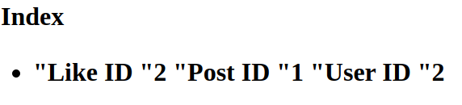

# いいねのAPI及びフロントエンド設計課題

テーマ：ユーザーがコンテンツに対して「いいね」を付与できるサービスを考える．

作者：Aiyi LI

## 内容

- Mysql表の設計：User，Post，Likeの3つの表．外部キーを使ってる．
- Goとの連接：Structによって対応，ドライバーを使って連接．
- Htmlでの表現：Htmlでコンテンツを一部表す．

## 環境と言語

- Ubuntu
- Golang
- Mysql
- Html

## 結果

　

一部Like表データの内容．

## 補足

- 本デモプログラムは実装コードです．
- 課題なので，実現したの内容は一部だ．

---

## 思考

1.　意外の挙動

今は，Likeの添加と削除を請求するときは，事前データベースにLikedかどうか判断する；存在しないユーザーあるいはポストから請求するなら，エラーだ．しかし，意外の挙動を対応できる．

2.　作者との通知

いける．Likeのとき，LikeをするときはPostのIDとUserのIDを記録する．PostのIDによって，作者を見つけるから，通知が届ける．

3.　ユーザーの体験

フロントエンドでLikeするとき，押すのアニメーションを加える；Unlikeを添加すること．
